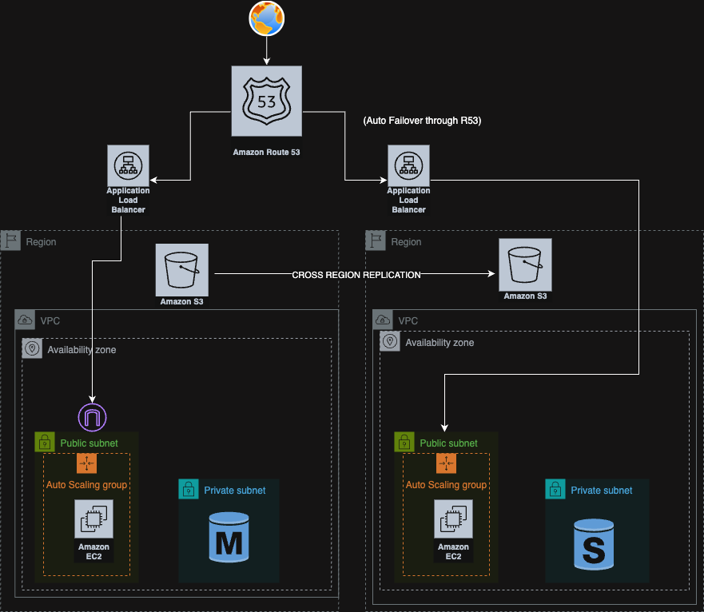

# AWS Disaster Recovery Project using Terraform

## 1. Project Description

This project demonstrates how to implement a **Disaster Recovery (DR)** architecture on AWS using **Terraform** with **Route 53 failover routing**. It provisions infrastructure in two AWS regions — a **primary** (us-east-1) and a **secondary (DR)** region (us-east-2) — to ensure **high availability**, **fault tolerance**, and **business continuity**.

Users are directed to the application via a **Route 53 DNS failover setup**. If the primary region (us-east-1) fails, traffic is automatically routed to the secondary region (us-east-2) using a **Route 53 health check** attached to the primary ALB.

The application is a simple static webpage served by Apache on EC2 instances behind ALBs in both regions. Static assets are stored in an S3 bucket with cross-region replication enabled.


---

## 2. Application Overview

The project sets up a simple static web page hosted on Apache running on EC2 instances. These instances are provisioned via **Auto Scaling Groups** behind an **Application Load Balancer (ALB)** in both regions. Static assets like images are hosted in **S3 buckets**, and S3 **cross-region replication** is configured to sync data from the primary to the DR region.

---

## 3. Architecture Diagram



---

## 4. Infrastructure Components

### ✅ Networking
- VPC (1 per region)
- Public and Private Subnets (2 per region)
- Internet Gateway
- NatGateway
- Route Tables

### ✅ Compute
- EC2 instances running Apache (installed via Launch Template)
- Auto Scaling Groups for automatic instance management

### ✅ Load Balancing
- Application Load Balancers (1 per region)
- Targets registered from Auto Scaling Group

### ✅ Storage
- S3 bucket in **us-east-1** (Primary)
- S3 bucket in **us-east-2** (DR)
- Cross-region replication enabled between buckets

### ✅ IAM
- IAM roles and instance profiles to grant S3 access to EC2
- S3 bucket policies for secure object access and replication

---

## 5. Key Features

- **High Availability**: Multi-AZ ALBs and ASGs ensure uptime within regions.
- **Disaster Recovery**: Infrastructure replicated to us-east-2 to handle outages in us-east-1.
- **S3 Replication**: Automatic data sync between primary and backup buckets.
- **Automation**: Fully managed via Terraform IAC.

---

## 6. Terraform File Breakdown

| File Name      | Description                                      |
|----------------|--------------------------------------------------|
| `terraform.tf` | Configures AWS providers for both regions        |
| `main.tf`      | Contains all AWS resource definitions            |
| `variables.tf` | Variables for modular and reusable code          |
| `outputs.tf`   | Outputs like ALB DNS and EC2 Public IPs          |
| `ec2_alb`      | Contains LT,SG,ASG,ALB.                          |
| `MasterRds`    | Rds-subnetgroup,RDS-SG,DB                        |
---

## 7.Failover Route53
This project includes a Route 53 failover routing policy to ensure continuous application availability.

### Components:
- **Route 53 Hosted Zone**: Associated with your domain (e.g., `jyoshna.online`)
- **Primary Record (A/ALIAS)**: Points to the ALB in us-east-1 with a health check
- **Secondary Record (A/ALIAS)**: Points to the ALB in us-east-2 (only used on failover)
- **Health Check**: Created for the ALB DNS name in us-east-1

### How It Works:
- Route 53 monitors the health of the primary ALB using the configured health check.
- If the ALB in **us-east-1 becomes unhealthy**, Route 53 automatically fails over DNS to the **ALB in us-east-2**.
- Users will experience minimal downtime during region failure.

### 🚀 Steps to Deploy

```bash
# Step 1: Clone the repo
git clone https://github.com/jyoshnabonagirirp7/disaster_recovery.git
cd disaster_recovery

# Step 2: Initialize Terraform
terraform init

# Step 3: Review the execution plan
terraform plan

# Step 4: Apply the configuration
terraform apply
```

## Author 

Sakala Jyoshna